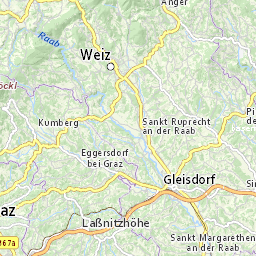

# optimize-png-mbtiles

Walks through all tiles in an mbtiles file (only **raster _PNG_ mbtiles** supported) and optimizes them (_in place!_) using [pngquant](https://pngquant.org/).

**`optimize-png-mbtiles` has been developed for and tested with [`basemap.at Verwaltungskarte Raster Offline Österreich (bmap_standard_mbtiles_L00bisL16.zip)`](https://www.data.gv.at/katalog/dataset/703fce40-6116-4836-aca4-7dddc33912ab).**


If it works with other mbtiles files is a game of luck and depends on their internal database schema and how they were created.
While `basemapat_standard16.MBTiles` adheres to the mbtiles spec from a read-only point of view, its internal database schema is different from the schema of mbtiles created with tools from the Mapbox universe (eg [node-mbtiles](https://github.com/mapbox/node-mbtiles)).

No analysis of the actual database schema is performed and `optimize-png-mbtiles` most likely will _**not**_ work with mbtiles created with Mapbox tools.


`basemapat_standard16.MBTiles` weighs in at **+16GB** which essentially makes it useless for its intended offline use (think mobile apps or shared hosting).

Maximum compression reduces those **+16GB to ~4.6GB**, still a lot, but much better to handle.


Maximum compression is of course noticeable in a side by side comparision, but not that bad either:

original | optimized
---- | ----
127KB <br /> | 31KB <br />
131KB <br /> | 31KB <br />
128KB <br /> | 33KB <br />
137KB <br /> | 32KB <br />

On my laptop optimizing `basemapat_standard16.MBTiles` takes about:
* **~30 minutes** for tile optimization
* **~3 minutes** for final database vacuum


# Usage

### Note:
```
Make sure there's enough free RAM before starting the tool. 
At least 5GB (7GB recommended, the more the better).
The final database vacuum needs a lot of it.
```

* download `bmap_standard_mbtiles_L00bisL16.zip` from [`basemap.at Verwaltungskarte Raster Offline Österreich`](https://www.data.gv.at/katalog/dataset/703fce40-6116-4836-aca4-7dddc33912ab)
* unzip `bmap_standard_mbtiles_L00bisL16.zip`
* get `optimizepngmbtiles` binary from [`Releases` tab](https://github.com/BergWerkGIS/optimize-png-mbtiles/releases) (sorry, Windows only)
* execute `optimizepngmbtiles.exe -f basemapat_standard16.MBTiles`

Default settings are optimized for size, sacrificing some quality on the way.

Adjust settings to get desired output quality. Even moderate compression without visible degradation will save a few GBs already.

```
λ optimizepngmbtiles.exe
  -f, --mbtiles=VALUE        Path to MBTiles
  -m, --min-quality=VALUE    PNG min quality [0..100]. Default:0
  -x, --max-quality=VALUE    PNG max quality [0..100]. Default:20
  -s, --speed=VALUE          PNG speed [1..10]. Slower better quality. Default:1
  -t, --threads=VALUE        Threads. Default (Processors):8
  -b, --batch-size=VALUE     Batch size. Number of tiles processed in one batch.
                                Default:1000
```